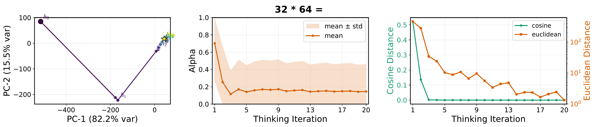

# LoopUS

Official repository for the paper _LoopUS: Recasting Pretrained LLMs into Looped Latent Refinement Models_.

## Framework


## Latent Reasoning PCA



## Installation

The codebase targets Python 3.10 or newer.
It was developed primarily in NVIDIA GPU environments with CUDA-enabled PyTorch, so non-NVIDIA setups may require small adjustments.

```bash
uv sync
```

For optional external integrations, create a local `.env` file:

```bash
HF_TOKEN=...
WANDB_KEY=...
```

## Quick Start

### 1. Pretraining

```bash
uv run ddd-train \
	--model-name Qwen/Qwen3-1.7B \
	--train-dataset HuggingFaceFW/fineweb-edu \
	--train-config CC-MAIN-2025-26 \
	--train-split train \
	--train-max-tokens 1500000000 \
	--batch-size 2 \
	--gradient-accumulation-steps 64 \
	--learning-rate 5e-5 \
	--max-length 1024 \
	--n-supervision 5 \
	--n-reasoning-steps 20 \
	--encoder-layers 0..1 \
	--decoder-layers 27..27 \
	--checkpoint-dir checkpoints/example_run
```

For a configurable template suitable for cluster jobs, see `script/train.sh`.

### 2. Supervised Fine-Tuning

```bash
uv run ddd-train-sft \
	--model-name Qwen/Qwen3-1.7B \
	--train-dataset HuggingFaceH4/ultrachat_200k \
	--train-split train_sft \
	--checkpoint-dir checkpoints_sft/example_run
```

### 3. Evaluation

```bash
uv run ddd-eval \
	--model-name Qwen/Qwen3-1.7B \
	--decomposed-model your-org/loopus-qwen3-1.7b \
	--tasks mmlu,hellaswag,arc_easy,arc_challenge,piqa,winogrande \
	--n-recursion 8 \
	--batch-size 8 \
	--max-length 1024 \
	--output-json results/eval.json
```

For a reusable evaluation template, see `script/eval_model.sh`.

### 4. Qualitative Generation

```bash
uv run ddd-generate \
	--model-name Qwen/Qwen3-1.7B \
	--decomposed-model your-org/loopus-qwen3-1.7b \
	--prompt "The meaning of life is" \
	--n-recursion 8
```

The legacy `test_model.py` entrypoint is kept as a thin compatibility wrapper around `generate.py`.

## Checkpoints and Model Loading

The public inference path supports three checkpoint sources:

1. a local `save_pretrained` directory
2. a Hugging Face Hub repository containing saved LoopUS weights
3. a legacy training checkpoint directory containing `combined_model.pt`

Both `evaluate.py` and `generate.py` use the same loading path through `utils/inference.py`, so evaluation and qualitative sampling follow identical checkpoint semantics.

## Reproducibility

- `TrainConfig` validates the main experimental settings before launch.
- `set_seed` fixes Python, NumPy, and PyTorch seeds.
- `training_runtime.py` centralizes checkpoint save/resume logic, schedulers, and external service setup.
- Evaluation is driven by `lm-eval` through `utils/lm_eval_harness.py`.
- The public shell templates in `script/` are intended to be editable run manifests for released experiments.

## Repository Structure

```text
.
├── train.py
├── train_sft.py
├── evaluate.py
├── generate.py
├── training_cli.py
├── training_runtime.py
├── models/
├── utils/
├── ds_configs/
└── script/
```

## License

This project is released under the Apache 2.0 License. See `LICENSE` for details.