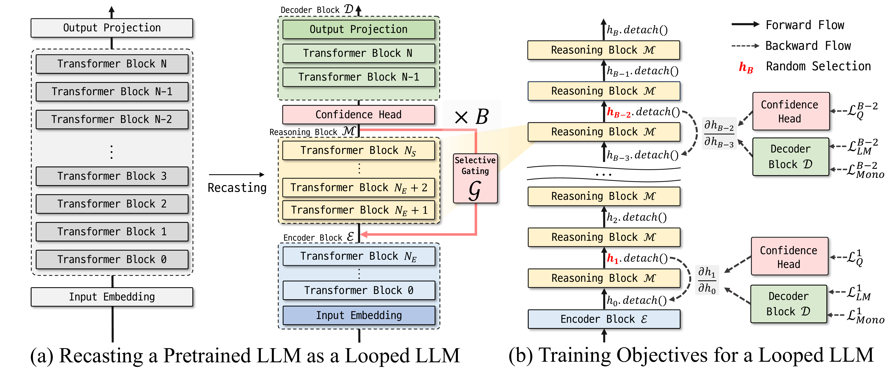

<div align="center">

<h1>LoopUS: <br> Recasting Pretrained LLMs into Looped Latent Refinement Models</h1>
<div>
  <a href="https://thrillcrazyer.github.io/" target="_blank"><strong>Taekhyun Park</strong></a><sup>1</sup>,
  <a href="https://yongzzai.com/" target="_blank"><strong>Yongjae Lee</strong></a><sup>1</sup>,
  <a href="https://aidoheekim.github.io/" target="_blank"><strong>Dohee Kim</strong></a><sup>2</sup>,
  <a href="https://pnubaelab.github.io/" target="_blank"><strong>Hyerim Bae</string></a><sup>1,&dagger;</sup>
</div>

<div>
  <sup>1</sup> Pusan National University,
  <sup>2</sup> Changwon National University
</div>

<sub><sup>*</sup> Corresponding author</sub>

<!-- [](https://arxiv.org/pdf/2605.04461) -->
[](https://thrillcrazyer.github.io/LoopUS)
[](https://huggingface.co/Thrillcrazyer/Qwen3_1.7B_LoopUS)

</div>

# Overview

LoopUS is a post-training framework that converts a standard pretrained LLM into a looped latent refinement model, enabling test-time compute scaling without training a recurrent architecture from scratch or heavily disrupting pretrained capabilities. Instead of extending output traces, LoopUS restructures the model into an encoder, a looped reasoning block, and a decoder, then performs iterative latent refinement in the hidden space. This design targets reasoning-oriented gains while keeping the system compatible with practical pretrained checkpoints and efficient training workflows.

## Method
1. **Block Decomposition:** recasts a pretrained transformer into an encoder, a looped reasoning block, and a decoder based on staged representation dynamics, turning a feed-forward backbone into a reusable latent-refinement architecture.
2. **Input-Dependent Selective Gate:** adaptively controls how refined hidden states are propagated across recursive steps, mitigating hidden-state drift and reducing the risk of representation collapse during looping.
3. **Random Deep Supervision:** applies supervision to sampled reasoning steps rather than every recursive step, making long-horizon loop training more memory-efficient while preserving optimization stability.
4. **Confidence Head for Adaptive Early Exit:** estimates whether additional refinement is still useful and allows the model to stop recursion early at inference time, improving compute-efficiency without changing the external generation format.



## Installation

The codebase targets Python 3.10 or newer.
It was developed primarily in NVIDIA GPU environments with CUDA-enabled PyTorch, so non-NVIDIA setups may require small adjustments.

```bash
uv sync
```

For optional external integrations, create a local `.env` file:

```bash
HF_TOKEN=...
WANDB_KEY=...
```

## Quick Start

### 1. Pretraining

```bash
uv run LoopUS-train \
	--model-name Qwen/Qwen3-1.7B \
	--train-dataset HuggingFaceFW/fineweb-edu \
	--train-config CC-MAIN-2025-26 \
	--train-split train \
	--train-max-tokens 1500000000 \
	--batch-size 2 \
	--gradient-accumulation-steps 64 \
	--learning-rate 5e-5 \
	--max-length 1024 \
	--n-supervision 5 \
	--n-reasoning-steps 20 \
	--encoder-layers 0..1 \
	--decoder-layers 27..27 \
	--checkpoint-dir checkpoints/example_run
```

For a configurable template suitable for cluster jobs, see `script/train.sh`.

### 2. Supervised Fine-Tuning

```bash
uv run LoopUS-train-sft \
	--model-name Qwen/Qwen3-1.7B \
	--train-dataset HuggingFaceH4/ultrachat_200k \
	--train-split train_sft \
	--checkpoint-dir checkpoints_sft/example_run
```

### 3. Evaluation

```bash
uv run LoopUS-eval \
	--model-name Qwen/Qwen3-1.7B \
	--decomposed-model Thrillcrazyer/Qwen1.7_LoopUS \
	--tasks mmlu,hellaswag,arc_easy,arc_challenge,piqa,winogrande \
	--n-recursion 8 \
	--batch-size 8 \
	--max-length 1024 \
	--output-json results/eval.json
```

For a reusable evaluation template, see `script/eval_model.sh`.

### 4. Qualitative Generation

```bash
uv run LoopUS-generate \
	--model-name Qwen/Qwen3-1.7B \
	--decomposed-model Thrillcrazyer/Qwen3-1.7B_ver0.2_5000 \
	--prompt "The meaning of life is" \
	--n-recursion 8
```

The legacy `test_model.py` entrypoint is kept as a thin compatibility wrapper around `generate.py`.

### 5. Chatting Mode

```bash
ur run chat.py \
	--model-name Thrillcrazyer/SFT_LDS_QWEN1.7B
```

`Thrillcrazyer/SFT_LDS_QWEN1.7B` is a model obtained by supervised fine-tuning `Thrillcrazyer/Qwen1.7_LoopUS` on `HuggingFaceH4/ultrachat_200k` for 1 epoch. It does not work perfectly yet.


## Checkpoints and Model Loading

The public inference path supports three checkpoint sources:

1. a local `save_pretrained` directory
2. a Hugging Face Hub repository containing saved LoopUS weights
3. a legacy training checkpoint directory containing `combined_model.pt`

Both `evaluate.py` and `generate.py` use the same loading path through `utils/inference.py`, so evaluation and qualitative sampling follow identical checkpoint semantics.

## Reproducibility

- `TrainConfig` validates the main experimental settings before launch.
- `set_seed` fixes Python, NumPy, and PyTorch seeds.
- `training_runtime.py` centralizes checkpoint save/resume logic, schedulers, and external service setup.
- Evaluation is driven by `lm-eval` through `utils/lm_eval_harness.py`.
- The public shell templates in `script/` are intended to be editable run manifests for released experiments.

## Repository Structure

```text
.
├── train.py
├── train_sft.py
├── evaluate.py
├── generate.py
├── training_cli.py
├── training_runtime.py
├── models/
├── utils/
├── ds_configs/
└── script/
```

## License

This project is released under the Apache 2.0 License. See `LICENSE` for details.

## GPU Sponsorship

We are always looking for GPU sponsorship. If you are interested, please contact pthpark1@pusan.ac.kr.